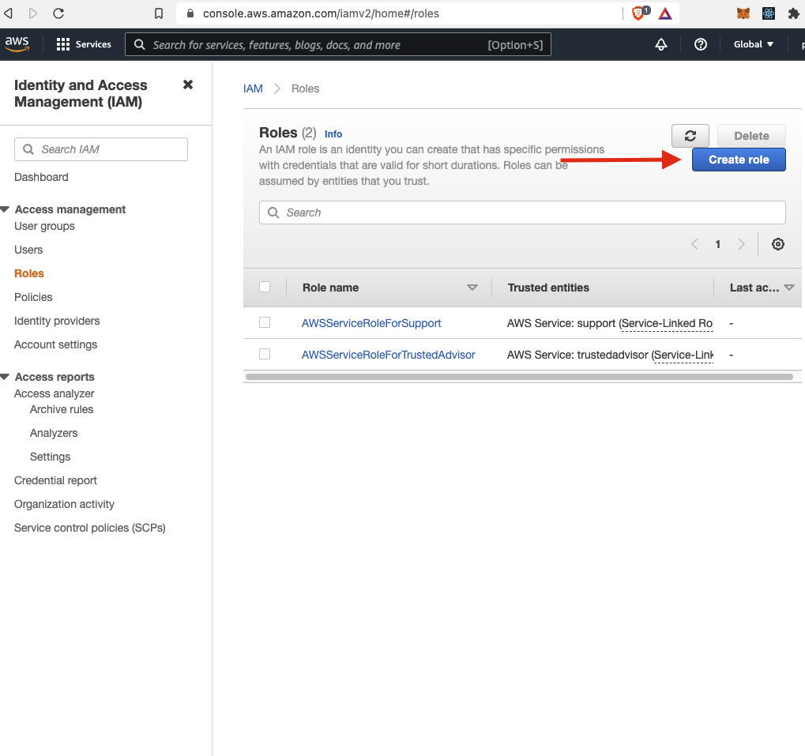
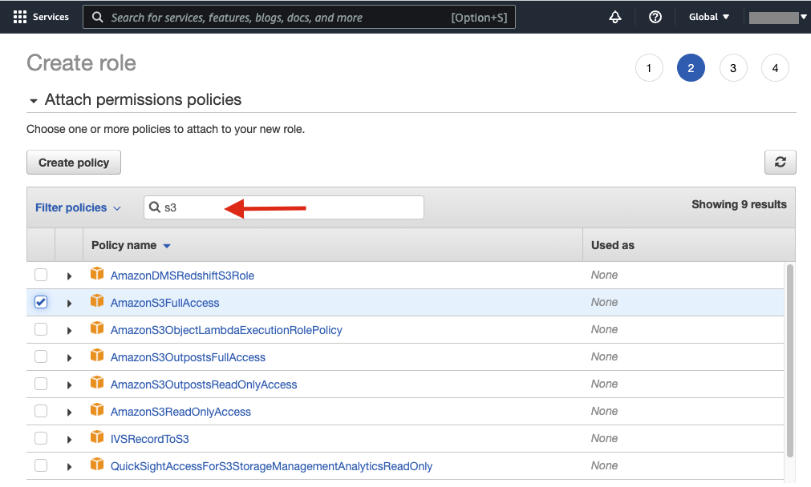
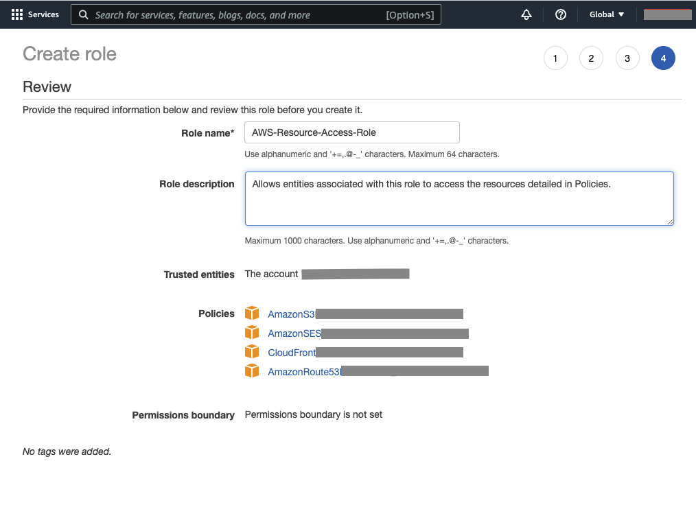
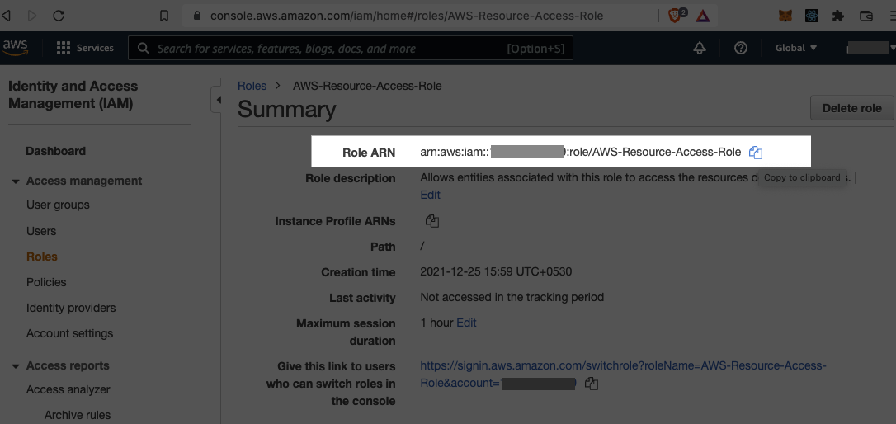

Use the following as a guide to manually create and associate an AWS IAM role with DShop

On a web browser, navigate to the 'Roles' tab in the IAM Dashboard of the AWS Management Console: https://console.aws.amazon.com/iamv2/home#/roles
Click on the 'Create role' button

**NOTE:** If you do not see the 'Create role' button, log out of the console and log back in as a root user. 

Select 'Another AWS account' as the _Trusted Entity_ and enter your root user Account ID. You can find your Account ID by clicking on your profile on the top-right of the page:

The policies you choose on the next screen will determine the kinds of (AWS) resources your DShop can access. For example, the policy **AmazonS3FullAccess** will allow DShop to create and delete Amazon S3 buckets on your behalf. Keywords for other AWS services supported by DShop include 'ses' (Amazon SES), 'cloudfront' (AWS CloudFront), and 'route53' (Amazon Route 53). 

On the last screen, enter a name for the role and review your policy selections. Click on the 'Create role' button:

After you're redirected to the Roles page, click on the newly-created role and copy the Role ARN. This information will be used to allow DShop to interface with AWS by "assuming" the role. 

